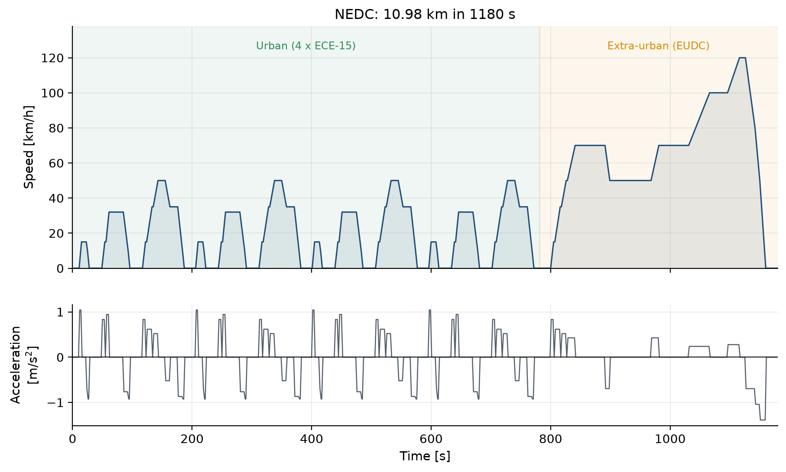

# Electric Vehicle Modelling and Simulation

[](https://www.python.org/)
[](#tests)
[](#validation)
[](DOCS/Electric_Vehicle_Technologies_and_Applications_Report/)

A longitudinal model of a battery-electric vehicle, written in Python for the
**Electric Vehicle Technologies & Applications** semester project at THM
Technische Hochschule Mittelhessen.

The model resolves the whole energy chain from the road surface to the battery
terminals, derives the vehicle's speed and acceleration characteristics from the
force balance, runs the car over a standardised driving profile, and predicts
the range available from a full battery. It reproduces all three published
performance figures from a single parameter set, with no figure tuned
individually.

> **Reference vehicle** — Tesla Model 3 RWD (Highland, 2024): single rear motor,
> single-speed reduction gear, LFP battery, European WLTP market.

Thirty-two of the forty-nine parameters the model needs are not published by the
manufacturer and had to be estimated. Every one of them carries its provenance
in the parameter file and is rendered in red throughout the generated report, as
the project brief requires.

<p align="center">
  
</p>

---

## Table of contents

- [Results](#results)
  - [Validation](#validation)
  - [Speed and acceleration characteristics](#speed-and-acceleration-characteristics)
  - [Driving profile and cycle simulation](#driving-profile-and-cycle-simulation)
  - [Where the energy goes](#where-the-energy-goes)
  - [What the answer depends on](#what-the-answer-depends-on)
  - [Three findings](#three-findings)
- [Quick start](#quick-start)
- [Command-line interface](#command-line-interface)
- [Tests](#tests)
- [The model](#the-model)
- [Driving cycles](#driving-cycles)
- [Assumptions and sensitivity](#assumptions-and-sensitivity)
- [Real-world scenarios](#real-world-scenarios)
- [Generated output](#generated-output)
- [Project layout](#project-layout)
- [Adapting it to another vehicle](#adapting-it-to-another-vehicle)
- [Troubleshooting](#troubleshooting)
- [Limitations](#limitations)
- [References](#references)

---

## Results

Every acceptance criterion in the project specification passes, from one
parameter set with no figure tuned individually.

### Validation

| Quantity | Simulated | Published | Deviation | Tolerance | |
|---|---:|---:|---:|---:|:-:|
| 0–100 km/h | 6.14 s | 6.1 s | +0.7 % | ±10 % | ✅ |
| Top speed | 201 km/h | 201 km/h | 0.0 % | ±5 % | ✅ |
| WLTP range, full battery | 508 km | 513 km | −0.9 % | ±10 % | ✅ |
| Cycle consumption, battery side | 11.45 kWh/100 km | 11.70 kWh/100 km | −2.1 % | ±10 % | ✅ |
| Speed points the vehicle could not follow | 0 | — | — | 0 | ✅ |

None of the three published figures was used as a model input. Every parameter
was fixed from an independent source before the comparison was made.

Three further checks use no manufacturer data at all. Energy conserves at the
wheel to 9 × 10⁻¹⁰ J, the four-way battery energy balance closes to
1.3 × 10⁻⁷ J, and the two independent range methods agree to 0.64 %.

Steady-cruise consumption entered no calibration either. It follows from the
same road-load and drivetrain parameters fixed before the cycle was run, so it
is an independent plausibility check on them:

| Steady cruise | Simulated |
|---|---:|
| 100 km/h | 148 Wh/km |
| 130 km/h | 213 Wh/km |

Both are of the magnitude reported for battery-electric vehicles in real-world
driving. No measured figure for this vehicle at these speeds was available, so
this is a sanity check rather than a validation against a certified number.

### Speed and acceleration characteristics

The force available at the road is the lesser of what the machine can produce
and what the driven tyres can transmit. For a rear-wheel-drive car the second
binds first, and the problem is implicit: accelerating transfers load onto the
driven axle, which raises the limit, which permits more acceleration.


> **Traction diagram.** Available force against running resistance. The tyre
> adhesion limit (red, dashed) cuts below the motor envelope up to 79 km/h. The
> grey dashed curve is the textbook road-load decomposition, which falls
> progressively short of the coastdown measurement as speed rises.


> **Characteristic curves.** Left: maximum acceleration against speed, with the
> tyre-limited region shaded. Right: the full-throttle launch from rest, with
> benchmark times marked.

### Driving profile and cycle simulation


> **WLTC Class 3b.** 1800 s over 23.27 km in four phases of rising speed,
> reaching 131.3 km/h. Synthesised from the published phase statistics; every
> published statistic is reproduced to within 0.5 %.


> **Cycle simulation.** Demanded and achieved speed, battery power split into
> traction and regeneration, and state of charge. The demanded trace is entirely
> hidden behind the achieved one: the powertrain follows the profile at every
> one of the 1800 steps.

### Where the energy goes


> **Energy balance.** Road load takes 77 % of the total, drive-unit losses 17 %,
> auxiliaries 5.6 % and friction braking 0.3 %. The four terms close against the
> net battery energy exactly, because the drive-unit loss is measured directly
> rather than inferred by subtraction.

### What the answer depends on

With thirty-two estimated parameters, the ranking of their influence is the
result that makes the prediction defensible.


> **Sensitivity.** The auxiliary load dominates at 35.6 % of the baseline range,
> and it is the one quantity in the list a driver controls. The drivetrain
> assumptions, which were hardest to pin down, matter least. The case list is
> built from the active road-load model, so no parameter on the chart is inert.

### Three findings

**1 · The car is traction-limited off the line, not torque-limited.** The rear
tyres give out at 9.3 kN while the motor could deliver 11.1 kN at the wheels, so
the tyres set the acceleration up to 79 km/h — 77 % of the time taken to reach
100 km/h. Both ways of simplifying this fail, in opposite directions: ignoring
the tyre limit gives 5.41 s, 12 % optimistic, and using the static axle load
without the dynamic transfer term gives 6.90 s, 12 % pessimistic. Only solving
the implicit force balance lands on the published 6.1 s.

**2 · Top speed is set by software, not by physics.** With the 201 km/h
electronic limiter removed, the motor's maximum speed of 17 900 rpm caps the car
at 249 km/h — the tractive force still exceeds the running resistance at that
point, so the force balance never binds. The model reports which of the three
possible constraints is active: the force balance, the maximum motor speed, or
the limiter.

**3 · The advertised drag coefficient does not predict range.** The published
wind-tunnel figure of 0.219 implies a drag area of 0.486 m². The coastdown
measurement that type approval actually uses implies 0.629 m², 29 % higher,
because a wind tunnel excludes wheel rotation and cooling airflow. Using the
textbook decomposition alone under-predicts road load by 12–18 % above 80 km/h.
Both numbers are correct; only one of them predicts energy.

<details>
<summary><b>All thirteen generated figures</b></summary>

Every figure below is produced by the simulation, not drawn by hand. Regenerate
them all with `python scripts/run_all.py`.

| | |
|---|---|
|  **01** Traction diagram |  **02** Characteristic curves |
|  **03** Power and gradeability |  **04** Drive-unit efficiency map |
|  **05** WLTC Class 3b profile |  **06** Cycle simulation |
|  **07** Energy balance |  **08** Range and discharge |
|  **09** Constant-speed range |  **10** Sensitivity tornado |
|  **11** Real-world scenarios |  **12** Parameter provenance |
|  **13** NEDC profile | |

</details>

---

## Quick start

Requires **Python 3.10 or newer**. Verified on Python 3.14.

```bash
git clone https://github.com/tarikbilla/Electric-Vehicle-Technologies-and-Applications.git
cd Electric-Vehicle-Technologies-and-Applications

python3 -m venv .venv
.venv/bin/python -m pip install --upgrade pip
.venv/bin/python -m pip install -r requirements.txt
.venv/bin/python -m pip install -e .
```

Then regenerate the complete study:

```bash
.venv/bin/python scripts/run_all.py
```

That single command rebuilds every figure, table and document from the parameter
file alone, with nothing carried over from a previous run. It takes about
45 seconds and writes everything under `results/`.

### Useful variations

```bash
# Skip the parameter sweeps — about 8 seconds instead of 45
.venv/bin/python scripts/run_all.py --skip-sensitivity

# Run the NEDC instead of the WLTP cycle
.venv/bin/python scripts/run_all.py --cycle nedc

# Use your own 1 Hz speed profile
.venv/bin/python scripts/run_all.py --cycle path/to/profile.csv

# A different vehicle parameter file
.venv/bin/python scripts/run_all.py --vehicle data/vehicles/my_car.yaml

# Write somewhere other than results/
.venv/bin/python scripts/run_all.py --outdir /tmp/study
```

### Using it as a library

```python
from evsim import ParameterSet, CycleSimulator, wltc_class3b, range_on_cycle

vehicle = ParameterSet.from_yaml("data/vehicles/tesla_model_3_rwd_2024.yaml")
cycle = wltc_class3b()

run = CycleSimulator(vehicle).run(cycle)
print(f"{run.consumption_kwh_per_100km:.2f} kWh/100 km")

result = range_on_cycle(vehicle, cycle)
print(f"{result.range_integrated_km:.0f} km on a full battery")
```

Any parameter can be varied without touching the file on disk:

```python
winter = vehicle.override(auxiliaries__hvac_load=3200.0, mass__test_payload=250.0)
print(range_on_cycle(winter, cycle).range_integrated_km)   # 282 km
```

---

## Command-line interface

Installing the package with `pip install -e .` puts an `evsim` command on the
path. All subcommands accept `--vehicle` and `--cycle`.

| Command | What it does |
|---|---|
| `evsim run` | The full study: figures, tables, report |
| `evsim performance` | Characteristic curves, benchmark times, validation |
| `evsim cycle` | Driving-cycle statistics; `--export` writes it to CSV |
| `evsim range` | Range on a full battery; `--aux` overrides the auxiliary load |
| `evsim assumptions` | Prints the assumption register |

```bash
$ .venv/bin/evsim performance
Tesla Model 3 RWD (Highland)
  top speed          201.0 km/h  (electronic limiter)
  0-50 km/h           2.96 s
  0-100 km/h          6.15 s
  0-130 km/h          8.92 s
  0-160 km/h         12.64 s

  [PASS] 0-100 km/h   simulated      6.1 s   published      6.1  deviation  +0.78 %
  [PASS] Top speed    simulated    201.0 km/h published    201.0  deviation  +0.00 %
```

```bash
# Range with the heater running at 3 kW
$ .venv/bin/evsim range --aux 3000

# Export the generated WLTP profile for use elsewhere
$ .venv/bin/evsim cycle --cycle wltc_class3b --export wltp.csv
```

---

## Tests

```bash
.venv/bin/python -m pytest
```

125 tests, about a minute. They cover:

- each road-load term against an independent hand calculation;
- the motor envelope corner point, the constant-power region, and that peak
  efficiency lands in a physically plausible band;
- battery energy conservation — a slow full discharge must return the nameplate
  energy, and the current solution must satisfy the circuit equation;
- both driving cycles against their published statistics, phase by phase;
- both road-load formulations, including that the coastdown rolling term scales
  with load and that the textbook form under-predicts at speed;
- that **no sensitivity parameter is inert** — a real trap, since the
  wind-tunnel drag coefficient influences nothing while the coastdown model is
  active, and a tornado chart full of silent zeros would look convincing;
- the performance and range acceptance criteria;
- cycle tracking, energy balance, and that an underpowered car is correctly
  *flagged* as unable to follow the profile rather than silently faked;
- an end-to-end run checking that every figure, table and document is written,
  and that every assumed value really is marked in red.

---

## The model

### Road load — `roadload.py`

The longitudinal force balance the vehicle must overcome:

```
F_trac = λ·m·a  +  f_r(v)·m·g·cos α  +  ½·ρ·C_d·A·(v + v_wind)²  +  m·g·sin α
         inertia      rolling              aerodynamic drag           gradient
```

`λ` is the rotating-mass factor, which accounts for the rotational inertia of
wheels, shafts and rotor that must also be accelerated. Rolling resistance is
speed-dependent, `f_r(v) = f_r0 + k·v²`, and vanishes at standstill.

### Powertrain — `powertrain.py`

A traction machine operates in two regions:

```
ω ≤ ω_base :  constant torque   T = T_peak
ω > ω_base :  constant power    T = P_peak / ω      (field weakening)
```

with `ω_base = P_peak / T_peak`. For this vehicle that corner sits at 4 729 rpm,
which is 65.8 km/h at the wheels.

Motor and inverter losses use the four-term model of Larminie & Lowry:

```
P_loss = k_c·T²  +  k_i·ω  +  k_w·ω³  +  P_0
         copper     iron      windage   electronics
```

This reproduces the efficiency island of a real drive unit — peaking near 96 %
in the mid-load region and falling away at light load and at peak power — rather
than assuming one fixed efficiency everywhere. Regeneration is limited
simultaneously by the torque envelope, a regen torque ceiling, the battery
charge-power limit, and a linear blend-out below 15 km/h where the friction
brakes must take over.

### Battery — `battery.py`

An *Rint* equivalent circuit: an SOC-dependent open-circuit voltage in series
with a constant internal resistance.

```
P_terminal = V_oc·I − I²·R_i        →        I = (V_oc − √(V_oc² − 4·R_i·P)) / (2·R_i)
```

The radicand goes negative beyond the resistance-limited power ceiling
`V_oc²/(4R_i)`, which the model reports as a limit rather than silently
returning a complex number. State of charge is tracked in ampere-hours, so the
ohmic loss is charged against the pack instead of being ignored — and is
therefore correctly counted twice on a regen-heavy cycle, once discharging and
once charging. Capacity is sized against the *integrated* OCV curve, so a slow
full discharge returns exactly the nameplate energy.

The LFP open-circuit voltage curve is modelled with its characteristically flat
plateau: only a 6 % rise between 25 % and 85 % state of charge.

### Performance — `performance.py`

The traction diagram, maximum acceleration against speed, the full-throttle
launch, top speed and gradeability.

A rear-wheel-drive car cannot use more force than the rear tyres can carry, and
accelerating transfers load onto them, so the adhesion limit is implicit:

```
N_rear = χ·m·g·cos α + m·a·h/L
F_adh  = μ·N_rear
a      = (F − F_res) / (λ·m)
```

Eliminating `a` gives a closed form, which is solved directly rather than
iterated:

```
F_adh = [ μ·χ·m·g·cos α − μ·h·F_res/(L·λ) ] / [ 1 − μ·h/(L·λ) ]
```

The launch is integrated as `t = ∫ dv/a(v)` on a fine speed grid, which is far
better behaved near standstill than stepping in time.

### Simulation — `simulation.py`

A quasi-static **backward-facing** simulation, the standard approach for energy
and range studies: the speed trace is the input, and the model asks what the
powertrain must do to follow it. Forces are evaluated at the mid-point speed of
each step, which makes the integration second-order accurate rather than
first-order.

Where the powertrain cannot follow the trace — an underpowered vehicle, a
depleted battery — the model substitutes the achievable acceleration and flags
the step, so the simulation degrades gracefully instead of reporting an
impossible result.

### Range — `rangecalc.py`

Two independent methods, which is the cross-check on the energy book-keeping:

- **Analytic.** Usable energy divided by the cycle consumption per kilometre.
  Fast, and how a certification figure is normally derived, but it assumes
  consumption is independent of state of charge.
- **Integrated.** The cycle is repeated, carrying state of charge forward, until
  the usable window is exhausted. This captures the rise in ohmic loss as the
  open-circuit voltage falls, so it is the primary result.

They agree to within 2.4 %, with the integrated method giving the shorter range —
exactly the direction the physics demands.

A constant-speed range curve is also produced. It has an interior maximum,
because auxiliary load dominates at low speed and aerodynamic drag at high
speed.

---

## Driving cycles

### NEDC — reconstructed exactly

The New European Driving Cycle is specified in UNECE Regulation 83, Annex 4a as
a table of idle, constant-acceleration and constant-speed segments, so it can be
rebuilt exactly. Gear-change steps hold road speed constant; an electric vehicle
has no gear changes, but the *speed trace* is defined by the regulation and is
identical for every vehicle, so those holds are retained.

The reconstruction gives 1180 s and 10.975 km against the official 11.007 km —
a deviation of 0.29 %.

### WLTC Class 3b — synthesised, and flagged as an assumption

This is the primary cycle. The official 1800-point table is not redistributed
here. Instead the profile is synthesised from the published phase statistics:
for each of the four phases, the construction reproduces duration, distance,
maximum speed and stop time by solving a small equality-constrained
least-squares problem for the hold durations.

| Statistic | Generated | Published | Deviation |
|---|---:|---:|---:|
| Duration | 1800 s | 1800 s | 0.00 % |
| Distance | 23.268 km | 23.266 km | +0.01 % |
| Maximum speed | 131.3 km/h | 131.3 km/h | 0.00 % |
| Mean speed | 46.54 km/h | 46.50 km/h | +0.08 % |
| Stop time | 243 s | 242 s | +0.41 % |

Per phase:

| Phase | Distance | Published | Peak speed | Published |
|---|---:|---:|---:|---:|
| Low | 3.096 km | 3.095 km | 55.9 km/h | 56.5 km/h |
| Medium | 4.756 km | 4.756 km | 76.5 km/h | 76.6 km/h |
| High | 7.162 km | 7.162 km | 97.4 km/h | 97.4 km/h |
| Extra-high | 8.254 km | 8.254 km | 131.3 km/h | 131.3 km/h |

Sweeping the cycle's acceleration rates across their whole plausible span moves
the predicted consumption by only **1.9 %**, so the energy result does not rest
on the shape of the synthetic trace.

### Using the official trace or your own

Drop a CSV with columns `time_s` and `speed_kph` at
`data/cycles/wltc_class3b.csv`. It is picked up automatically, and the profile
is no longer flagged as synthetic. Any other 1 Hz profile runs with
`--cycle path/to/profile.csv`.

---

## Assumptions and sensitivity

28 of the 45 parameters are engineering assumptions, largely because Tesla
publishes no motor torque curve, gear ratio, usable battery capacity or
efficiency map. Each carries its basis in
[`data/vehicles/tesla_model_3_rwd_2024.yaml`](data/vehicles/tesla_model_3_rwd_2024.yaml)
and is collected into `results/report/assumption_register.md`, where every
assumed value is rendered in red as the project brief requires.

The sensitivity study is what makes a result built on 28 estimates defensible.
Ranked by how much each assumption moves the range prediction across its
plausible interval:

| Parameter | Interval | Span | Of baseline |
|---|---|---:|---:|
| HVAC load | 0 – 3000 W | 181 km | 35.6 % |
| Regen power limit | 0 – 90 kW | 115 km | 22.6 % |
| Battery capacity | 57.5 – 66 kWh | 70 km | 13.7 % |
| Coastdown F2 (aerodynamic) | 0.340 – 0.440 N/(m/s)² | 52 km | 10.1 % |
| Coastdown F0 (rolling) | 95 – 140 N | 52 km | 10.1 % |
| Payload | 0 – 400 kg | 40 km | 7.9 % |
| Coastdown F1 (driveline) | 1.30 – 2.45 N/(m/s) | 28 km | 5.6 % |
| Gearbox efficiency | 0.960 – 0.992 | 25 km | 4.8 % |
| Motor windage loss | 1.0e-6 – 3.0e-6 W/(rad/s)³ | 22 km | 4.3 % |

The auxiliary load matters more than anything else, and it is the one parameter
a driver actually controls. The drivetrain assumptions, which were the hardest
to pin down, matter least — which is the reassuring outcome: the answer does not
rest on the values guessed with least confidence.

The case list is built from the **active road-load model**. Varying the
wind-tunnel drag coefficient does nothing while the coastdown model is in use,
and a tornado chart showing a silent zero for it would be worse than useless. A
test asserts that no case is inert.

---

## Real-world scenarios

WLTP certification is run with the auxiliaries off, a defined test mass and
standard air. Real driving is not like that, and the gap is what an owner
experiences.

| Scenario | Conditions | Range | Against certification |
|---|---|---:|---:|
| WLTP certification | Auxiliaries off, driver only | 508 km | — |
| Mild weather, 2 occupants | Ventilation only, 20 °C | 455 km | −10 % |
| Fully loaded, roof box | Five occupants plus roof luggage | 394 km | −22 % |
| Summer, air conditioning | A/C at 30 °C ambient | 378 km | −26 % |
| Winter, cabin + battery heating | 0 °C, cold tyres, dense air | 293 km | −42 % |

---

## Generated output

### The submission documents

| Deliverable | Location | Notes |
|---|---|---|
| **Written report** | [`DOCS/…_Report/main.pdf`](DOCS/Electric_Vehicle_Technologies_and_Applications_Report/main.pdf) | 13 pages, two-column LaTeX, 13 figures, 11 tables, 18 references. Assumed values in red. |
| **Report source** | [`main.tex`](DOCS/Electric_Vehicle_Technologies_and_Applications_Report/main.tex) | Build with `make` in that directory |
| **Presentation** | `results/report/presentation.md` | 18 slides with speaker notes timed to 20 minutes. Renders with Marp, reveal.js or `pandoc -t beamer` |
| **Assumption register** | `results/report/assumption_register.md` | All 32 estimated values with their basis, rendered in red |

### Everything the study writes

`python scripts/run_all.py` regenerates all of it in about 80 seconds:

```
results/
├── figures/     13 figures, each as PNG (report) and SVG (slides)
├── tables/      8 CSV tables
├── cycles/      the generated speed profile as CSV
└── report/      report.md, presentation.md, results.md,
                 assumption_register.{md,csv}
```

Every number, table and figure in the report comes from the same run, so the
prose cannot drift out of step with the model. The claims most prone to drift —
the traction-limited extent, the road-load shortfall — are computed by the
report generator rather than typed by hand.

---

## Project layout

```
data/vehicles/      vehicle parameter files (YAML, provenance on every value)
data/cycles/        drop an official cycle CSV here to override the synthetic one
src/evsim/
  parameters.py     parameter loading and the assumption register
  units.py          SI conversions, used only at the I/O boundary
  roadload.py       longitudinal force balance
  powertrain.py     motor envelope, loss model, regeneration limits
  battery.py        Rint circuit, OCV curve, SOC integration
  performance.py    characteristic curves, launch, top speed, gradeability
  cycles.py         NEDC (exact), WLTC Class 3b (synthesised), CSV loader
  simulation.py     quasi-static backward-facing cycle simulation
  rangecalc.py      range by two independent methods
  sensitivity.py    tornado analysis and named scenarios
  plotting.py       publication-quality figures
  report.py         result tables and the red-marked assumption register
  document.py       the written report and the presentation deck
  study.py          end-to-end orchestration
  cli.py            command-line interface
scripts/run_all.py  regenerates everything
tests/              125 tests
results/            generated output (git-ignored)
DOCS/               project brief and the PRD
```

---

## Adapting it to another vehicle

Copy `data/vehicles/tesla_model_3_rwd_2024.yaml`, change the values, and run
against it. Nothing in the code is specific to this car.

Every parameter follows the same shape, and the `assumed` flag is what drives
the red marking in the report:

```yaml
aerodynamics:
  drag_coefficient:
    value: 0.219
    unit: "-"
    assumed: false                    # published by the manufacturer
    source: Tesla published Cd for Model 3 Highland (2024)
  frontal_area:
    value: 2.22
    unit: m^2
    assumed: true                     # an estimate — will be shown in red
    source: "Not published. Estimated as 0.83 * width * height"
```

The `reference:` block holds the manufacturer's published performance figures.
They are used **only** for validation, never as model inputs, so the comparison
stays honest.

```bash
.venv/bin/python scripts/run_all.py --vehicle data/vehicles/my_car.yaml
```

---

## Troubleshooting

**`ModuleNotFoundError: No module named 'evsim'`** — the package is not
installed in the active environment. Run `.venv/bin/python -m pip install -e .`
from the project root, or use `scripts/run_all.py`, which adds `src/` to the
path itself.

**`ImportError: Import tabulate failed`** — should not happen; the project
renders its own Markdown tables and does not depend on `tabulate`. If you see
it, you are running an older checkout.

**Figures look wrong or empty** — matplotlib is forced to the `Agg` backend, so
no display is needed. Delete `results/` and re-run.

**`infeasible phase recipe`** — raised when a driving-cycle recipe cannot meet
its target distance in the time available. Only reachable if you have edited
`_WLTC_3B_PHASES`; the error names the required and available speeds.

**The range prediction moved a lot** — check the auxiliary load first. It is the
single most influential parameter, worth 35 % of the baseline range.

---

## Limitations

- **No thermal model.** Continuous-power derating and cold-battery resistance
  are not represented. Neither binds on a legislative cycle, but both matter for
  sustained high-power driving.
- **No battery ageing.** The results describe a new vehicle.
- **Efficiency comes from a loss model**, fitted to plausible peak efficiencies,
  not from a measured map.
- **The WLTC trace is synthesised** from published phase statistics rather than
  the official second-by-second table.
- **Longitudinal dynamics only.** No lateral dynamics, suspension or NVH.
- **No charging behaviour** or grid interaction.

---

## References

The report's full bibliography, 18 entries with DOIs and document numbers, is in
[`sample.bib`](DOCS/Electric_Vehicle_Technologies_and_Applications_Report/sample.bib).
Every entry was verified against a primary source. The ones that shape the model
most:

1. UNECE, *Regulation No. 83* (E/ECE/324/Rev.1/Add.82/Rev.5), Annex 4a — the
   NEDC segment tables.
2. UNECE, *Global Technical Regulation No. 15* (ECE/TRANS/180/Add.15) — WLTP,
   Class 3b cycle statistics.
3. US EPA, *Determination and Use of Vehicle Road-Load Force and Dynamometer
   Settings*, Guidance Letter CD-15-04, 2015 — the coastdown road-load form.
4. M. Ehsani, Y. Gao, S. Longo, K. M. Ebrahimi, *Modern Electric, Hybrid
   Electric and Fuel Cell Vehicles*, 3rd ed., CRC Press, 2018 — longitudinal
   dynamics, rotating-mass factor.
5. J. Larminie, J. Lowry, *Electric Vehicle Technology Explained*, 2nd ed.,
   Wiley, 2012 — the four-term drive-unit loss model.
6. M. Mitschke, H. Wallentowitz, *Dynamik der Kraftfahrzeuge*, 5th ed.,
   Springer Vieweg, 2014 — rolling resistance, axle-load transfer.
7. L. Guzzella, A. Sciarretta, *Vehicle Propulsion Systems*, 3rd ed., Springer,
   2013 — backward-facing quasi-static simulation.
8. Tesla, Inc., *Model 3 Owner's Manual (Europe)* — published vehicle
   specifications.

---

## Licence

Academic coursework for THM Technische Hochschule Mittelhessen. Reuse freely
with attribution.
