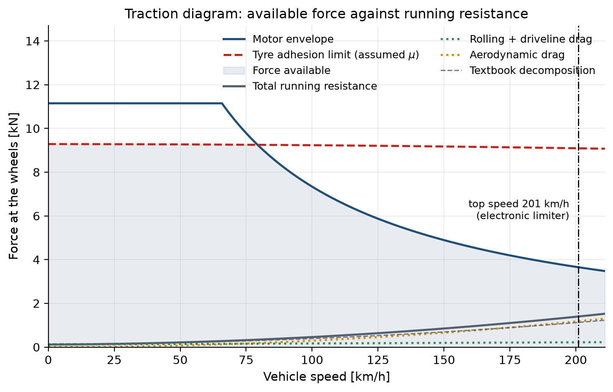
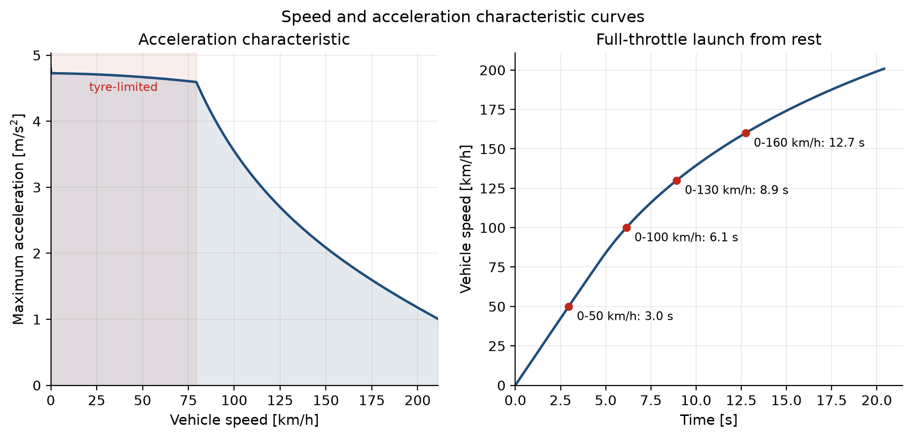
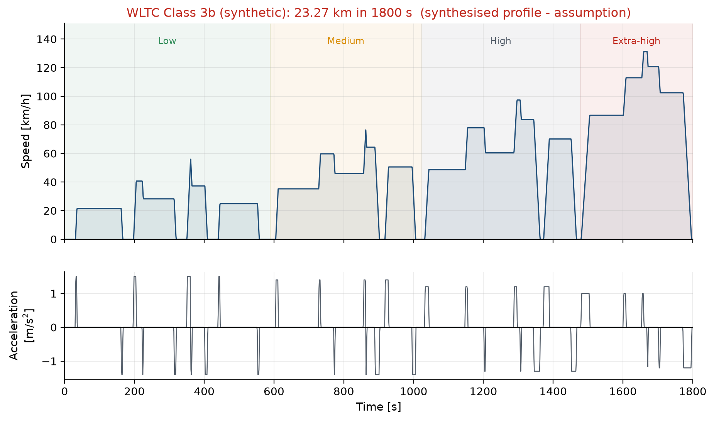
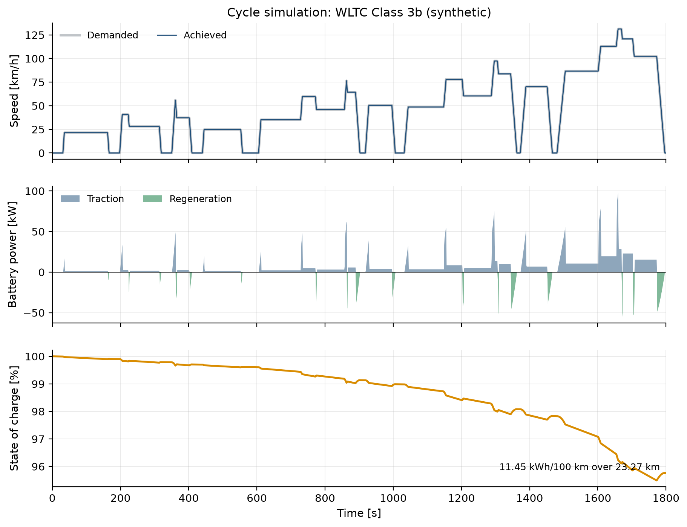
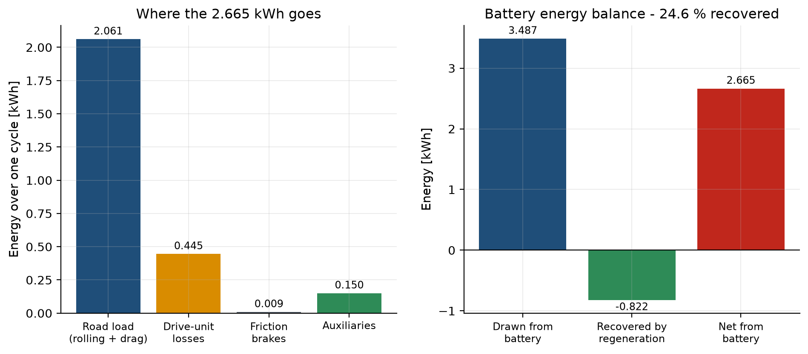
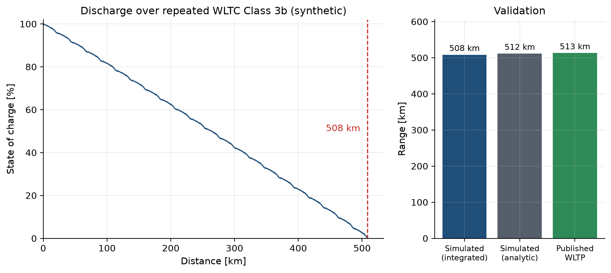
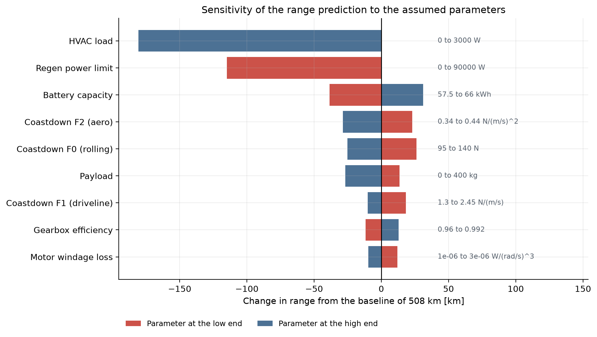

# Modelling and Simulation of an Electric Vehicle

## Tesla Model 3 RWD (Highland)

Electric Vehicle Technologies & Applications

15 September 2026

<!-- Speaker notes (0.5 min): introduce the vehicle and the question. We are asked: how far does it really go, and can we predict that from physics rather than from the brochure? -->

---

## The question

Range is not a property of the battery.

It is the outcome of a chain where every link loses something:

- tyres and air resist motion
- the drive unit converts electricity to torque imperfectly
- the battery dissipates part of its own output
- the cabin draws power whether you move or not

**The weakest assumption sets the accuracy of the answer.**

<!-- Speaker notes (1 min): this framing matters because it tells the audience why the sensitivity study at the end is the real result. -->

---

## The vehicle

| | |
|---|---|
| Drivetrain | Single rear motor, single-speed reduction gear |
| Motor | 208 kW, 420 N m |
| Battery | 62.5 kWh LFP |
| Test mass | 1865 kg |
| Published 0-100 km/h | 6.1 s |
| Published WLTP range | 513 km |

**32 of 49 parameters had to be estimated** - Tesla publishes no motor map, gear ratio or usable capacity.

<!-- Speaker notes (1.5 min): be upfront about the assumption count. It is the honest starting point and sets up the sensitivity study. -->

---

## Model structure

```
speed demand -> wheel force -> motor torque -> electrical power -> battery
```

- **Road load** rolling, driveline and aerodynamic resistance
- **Tyres** adhesion limit with dynamic axle-load transfer
- **Motor** constant torque, then constant power; four-term loss model
- **Battery** open-circuit voltage curve plus internal resistance

Quasi-static, backward-facing, one-second steps, forces at the mid-point speed.

<!-- Speaker notes (1.5 min): explain backward-facing - the trace is the input, we ask what the powertrain must do. No driver model needed. -->

---

## Finding 1: the car is traction-limited, not torque-limited



Tyres transmit 9.3 kN; the motor could deliver 11.1 kN.

<!-- Speaker notes (2 min): this is the first real result. Without dynamic load transfer the acceleration prediction is ~15% optimistic. Point at where the red adhesion line cuts below the motor envelope. -->

---

## Speed and acceleration characteristics



0-100 km/h: **6.14 s** simulated against 6.1 s published (+0.7 %)

<!-- Speaker notes (1 min): the left panel shows the tyre-limited region shaded. The right panel is the launch with benchmark times marked. -->

---

## Finding 2: top speed is a software decision

- Electronic limiter: **201 km/h**
- Motor maximum speed would allow 249 km/h
- The force balance never binds at all

The model reports *which* of the three constraints is active, rather than just a number.

<!-- Speaker notes (1 min): worth dwelling on - many models silently return whichever limit happened to bind. -->

---

## The driving profile



WLTC Class 3b: 1800 s, 23.27 km, peak 131.3 km/h

<!-- Speaker notes (1.5 min): chosen because the published range is certified on it, so model and reference describe the same drive. Mention the synthesis and that every published statistic is matched to within 0.5%. -->

---

## Finding 3: the advertised drag coefficient does not predict range

| | Drag area |
|---|---:|
| Published wind-tunnel Cd | 0.486 m² |
| Coastdown measurement | 0.629 m² |

**29 % higher.** The wind tunnel excludes wheel rotation and cooling flow.

Using the textbook decomposition alone under-predicts road load by 15-19 % above 80 km/h.

<!-- Speaker notes (2 min): the most interesting finding. Both numbers are correct; they measure different things. Only one predicts energy. -->

---

## Cycle simulation



**11.45 kWh/100 km**, 25 % recovered by regeneration, zero steps the powertrain could not follow

<!-- Speaker notes (1 min): the demanded trace is hidden behind the achieved one, which is the point. Note the SOC ticks upward on every deceleration. -->

---

## Where the energy goes



<!-- Speaker notes (1 min): the four bars close exactly against the net battery energy - that identity is a check on the book-keeping, not a coincidence. -->

---

## Range on a full battery



**508 km** against 513 km published (-0.9 %)

<!-- Speaker notes (1.5 min): two independent methods agree to 0.64%, which is the cross-check on the energy accounting. -->

---

## Validation

| Quantity | Simulated | Published | Deviation |
|---|---:|---:|---:|
| 0-100 km/h | 6.1 s | 6.1 | +0.7 % |
| Top speed | 201.0 km/h | 201.0 | +0.0 % |
| WLTP range (full battery) | 508.3 km | 513.0 | -0.9 % |
| Cycle consumption (battery side) | 11.5 kWh/100km | 11.7 | -2.1 % |

One parameter set. No per-result tuning.

<!-- Speaker notes (1 min): emphasise that none of these three was used to calibrate the model. -->

---

## The real result: what the answer depends on



**HVAC load** alone is worth 36 % of the range.

<!-- Speaker notes (1.5 min): the aerodynamic and drivetrain assumptions we were least sure about turn out to matter least. That is what makes a result built on estimates defensible. -->

---

## What a driver actually sees

| Scenario | Range |
|---|---:|
| WLTP certification | 508 km |
| Mild weather, 2 occupants | 455 km |
| Summer, air conditioning | 378 km |
| Winter, cabin + battery heating | 293 km |
| Fully loaded, roof box | 394 km |

A 215 km spread. Nothing is wrong with the car.

<!-- Speaker notes (1 min): good closing point before conclusions - connects the physics back to lived experience. -->

---

## Conclusions

Three published figures reproduced from one parameter set:

- 0-100 km/h within 0.7 %
- top speed exactly
- WLTP range within 0.9 %

**Traction, not torque, limits the launch.**
**Software, not physics, limits the top speed.**
**The brochure drag coefficient does not predict range.**

<!-- Speaker notes (1 min): close on the three findings, then take questions. The slides are timed to 20 minutes exactly, as the brief asks; questions come after. -->

---

## Limitations

- No thermal model: no continuous-power derating, no cold-battery resistance
- No battery ageing: results describe a new vehicle
- Drive-unit efficiency from a fitted loss model, not a measured map
- Longitudinal dynamics only

<!-- Speaker notes: hold this slide in reserve for questions. -->
