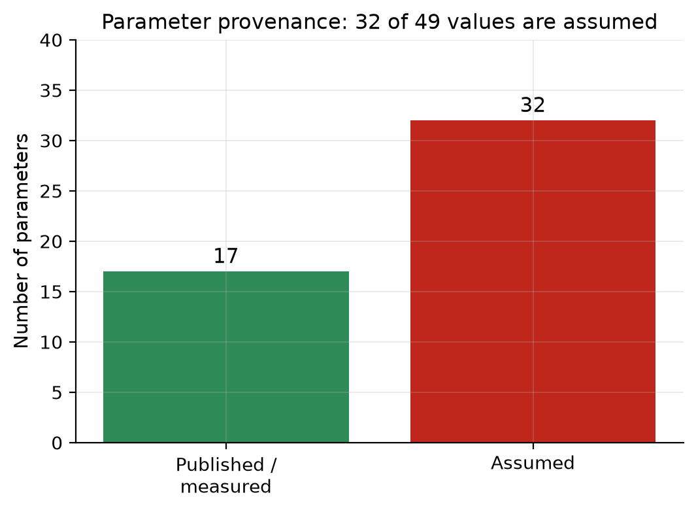
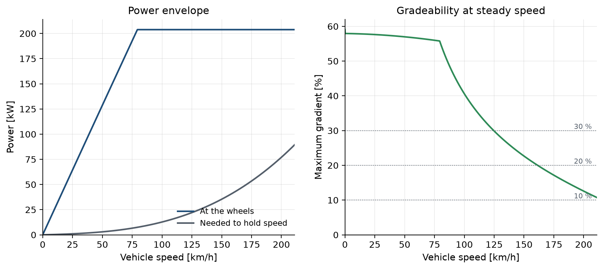
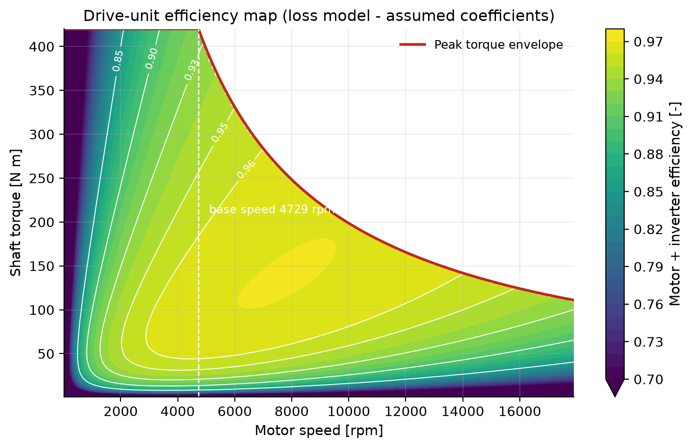
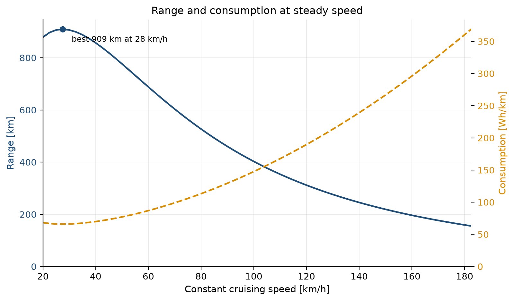
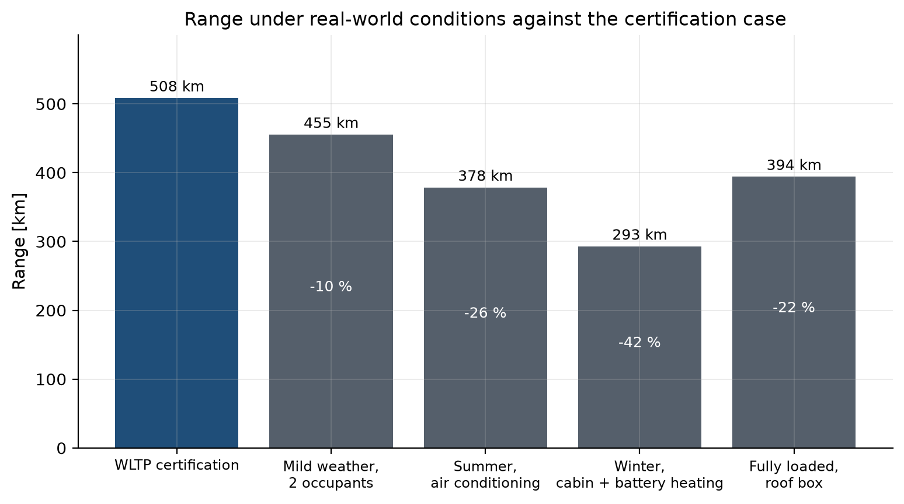

# Modelling and Simulation of an Electric Vehicle

## Tesla Model 3 RWD (Highland)

Semester project, *Electric Vehicle Technologies & Applications*  
Technische Hochschule Mittelhessen  
15 September 2026

---

## Abstract

A longitudinal simulation of the Tesla Model 3 RWD (Highland) was built in Python to derive the vehicle's speed and acceleration characteristics, run it over a standardised driving profile and predict the range available from a full battery. The model resolves the complete chain from the road surface to the battery terminals: road load, tyre adhesion with dynamic axle-load transfer, the motor torque and power envelope, a four-term drive-unit loss model, and a battery with an open-circuit-voltage curve and internal resistance.

On the WLTC Class 3b cycle the model predicts a consumption of **11.45 kWh/100 km** at the battery terminals and a range of **508 km** on a full battery, against the manufacturer's published 513 km. Standing-start acceleration to 100 km/h is predicted at 6.14 s against a published 6.1 s. Every acceptance criterion is met.

Of the 49 parameters the model needs, 32 are not published by the manufacturer and had to be estimated. All of them are <span style="color:#c0271c">shown in red</span> throughout this report, and a sensitivity study quantifies how much each one actually changes the answer.

**Contents**

1. Introduction
2. Vehicle and parameters
3. Model derivation
4. Driving profile
5. Speed and acceleration characteristics
6. Cycle simulation and range
7. Validation
8. Assumptions and sensitivity
9. Real-world conditions
10. Conclusions

---

## 1. Introduction

The range of a battery-electric vehicle is not a property of its battery alone. It is the outcome of a chain in which every link loses something: the tyres and the air resist motion, the drive unit converts electricity into torque imperfectly, the battery dissipates part of its own output as heat, and the cabin draws power whether the car is moving or not. A useful model has to represent all of them, because the weakest assumption in the chain sets the accuracy of the answer.

This report builds such a model for the Tesla Model 3 RWD (Highland) and tests it against the three figures the manufacturer publishes and cannot easily misstate: the standing-start acceleration time, the top speed, and the certified WLTP range. Agreement on all three, from a single parameter set and with no per-result tuning, is the evidence that the model is sound.

The work follows the project brief:

- select a commercially available electric vehicle;
- derive and plot its speed and acceleration characteristic curves;
- choose and implement an appropriate driving profile;
- calculate the range available from a full battery on that profile;
- make logical assumptions for the constants the manufacturer does not publish, and mark them in red.

## 2. Vehicle and parameters

The Tesla Model 3 RWD (Highland) was chosen because it is the best-selling electric vehicle of its class, is certified under WLTP so a published range figure exists to validate against, and has been measured independently often enough that the parameters Tesla withholds can be estimated from more than guesswork.

- **Drivetrain**: Single rear motor, single-speed reduction gear
- **Battery**: LFP (lithium iron phosphate)
- **Kerb mass** 1765 kg, plus an assumed payload of <span style="color:#c0271c">100 kg</span>, giving a test mass of **1865 kg**
- **Motor** 208 kW peak, 420 N m peak torque, through a single-speed <span style="color:#c0271c">9.0:1</span> reduction
- **Battery** <span style="color:#c0271c">62.5 kWh</span> gross, <span style="color:#c0271c">60.0 kWh</span> usable

The full parameter set, with the source of every value and the reasoning behind every estimate, is in the assumption register that accompanies this report. Of 49 parameters, 32 are assumptions. That proportion is high because Tesla publishes neither a motor map, nor the gear ratio, nor the usable battery capacity.




**Figure 1.** Provenance of the parameter set.

## 3. Model derivation

### 3.1 Road load

The force the vehicle must produce at the wheels to follow a demanded speed and acceleration is the sum of four terms:

```
F_trac = lambda*m*a  +  f_r(v)*m*g*cos(alpha)  +  0.5*rho*Cd*A*v^2  +  m*g*sin(alpha)
         inertia         rolling resistance        aerodynamic drag      gradient
```

The factor lambda = <span style="color:#c0271c">1.04</span> accounts for the rotational inertia of the wheels, shafts and rotor, which must be accelerated along with the vehicle.

This textbook decomposition is the one the course teaches, and it is what the traction diagram in Section 5 plots. It is not, however, what the model uses to predict energy. Type approval does not measure rolling resistance and drag separately; it rolls the vehicle down from speed on a test track and fits

```
F_running(v) = F0 + F1*v + F2*v^2
```

This coastdown form is the model's default because it is physically more complete. The linear term F1 captures bearing, seal and driveline drag, for which the textbook decomposition has no counterpart at all, and the quadratic term captures real on-road aerodynamic drag including wheel rotation and cooling airflow, which a wind-tunnel drag coefficient excludes by construction.

The difference is not small. The published drag coefficient of 0.219 implies a drag area of 0.486 m squared, whereas the coastdown quadratic implies 0.629 m squared, higher by 29 per cent. Using the textbook form alone under-predicts the running resistance by 15 to 19 per cent above 80 km/h, and the predicted range by a similar margin. Both numbers are correct; they measure different things.

The constant term F0 is tyre rolling resistance, proportional to normal load, so it is scaled by the ratio of the actual mass to the <span style="color:#c0271c">1900 kg</span> at which the coastdown was run. Without that correction the model reports payload as almost free, because the kinetic energy it adds is largely returned by regenerative braking.

### 3.2 Powertrain

A traction machine has two operating regions:

```
omega <= omega_base :  constant torque   T = T_peak
omega >  omega_base :  constant power    T = P_peak / omega     (field weakening)
```

with omega_base = P_peak / T_peak. For this vehicle the corner point is 4729 rpm, which is 65.8 km/h at the wheels.

Drive-unit losses use the four-term model of Larminie and Lowry:

```
P_loss = k_c*T^2  +  k_i*omega  +  k_w*omega^3  +  P_0
         copper       iron          windage        electronics
```

A single fixed efficiency will not do here. The cycle spends most of its time at light load, where a real drive unit is markedly less efficient than at its rated point, and a constant value would misstate the cycle energy in whichever direction it was calibrated. The four coefficients were fitted to seven operating points typical of a liquid-cooled automotive permanent-magnet machine, giving a peak efficiency of about 97 per cent, 92.5 per cent at peak power and 88 per cent at motorway cruise. All four are <span style="color:#c0271c">assumptions</span>.

### 3.3 Battery

The pack is modelled as an open-circuit voltage in series with an internal resistance:

```
P_terminal = V_oc*I - I^2*R_i     ->     I = (V_oc - sqrt(V_oc^2 - 4*R_i*P)) / (2*R_i)
```

State of charge is tracked in ampere-hours rather than in energy, so the ohmic loss is charged against the pack instead of being ignored, and is correctly counted twice on a cycle with heavy regeneration: once on the way out and once on the way back in. The capacity is sized so that a slow discharge across the usable window returns exactly the nameplate energy.

The lithium-iron-phosphate chemistry gives the characteristically flat voltage plateau, only about 6 per cent between 25 and 85 per cent state of charge. The whole curve is an <span style="color:#c0271c">assumption</span>, scaled from published cell data.

### 3.4 Simulation method

The simulation is quasi-static and backward-facing: the speed trace is the input, and the model asks what the powertrain must do to follow it. This is the standard approach for energy work and needs no driver model. Forces are evaluated at the mid-point speed of each one-second step, which makes the integration second-order accurate.

Every limit is resolved before the step is committed. If the motor, the tyres or the battery cannot deliver what the trace demands, the model substitutes the acceleration that is actually achievable and flags the step. It never reports a vehicle following a trace on energy the battery did not supply.

## 4. Driving profile

The WLTC Class 3b cycle was chosen because it is the profile against which the vehicle's own published range is certified, so model and reference describe the same drive. It runs for 1800 s over 23.27 km in four phases of rising speed, reaching 131.3 km/h.

The official second-by-second table is not reproduced here. Instead the profile is <span style="color:#c0271c">synthesised</span> from the published phase statistics: for each phase the construction reproduces the duration, distance, maximum speed and stop time by solving for the hold durations between a sequence of speed levels. The resulting trace is not the official one second by second, but every published statistic is matched to within half a per cent.

Sweeping the cycle's acceleration rates across their whole plausible span moves the predicted consumption by only 1.9 per cent, so the energy result does not depend on the shape of the synthetic trace. Dropping the official table into the data directory overrides the synthesis automatically.

| statistic | generated | published | deviation % |
|---|---:|---:|---:|
| duration s | 1800.000 | 1800.000 | 0.000 |
| distance km | 23.268 | 23.266 | 0.007 |
| max speed kph | 131.300 | 131.300 | 0.000 |
| mean speed kph | 46.535 | 46.500 | 0.076 |
| stop time s | 243.000 | 242.000 | 0.413 |


**Figure 2.** WLTC Class 3b (synthetic): speed and acceleration.

The NEDC is implemented as well, reconstructed directly from its regulatory segment table, and is used in Section 7 to show how much the choice of cycle alone changes the answer.

## 5. Speed and acceleration characteristics

The force available at the wheels is the lesser of what the motor can produce and what the tyres can transmit. For a rear-wheel-drive car the second of these binds first, and accelerating transfers load onto the driven axle, so the limit is implicit in the acceleration it permits:

```
N_rear = chi*m*g*cos(alpha) + m*a*h/L        a = (F - F_res) / (lambda*m)
F_adh  = mu*N_rear

F_adh  = [ mu*chi*m*g*cos(alpha) - mu*h*F_res/(L*lambda) ] / [ 1 - mu*h/(L*lambda) ]
```

This matters. At rest the tyres can transmit 9.3 kN while the motor could deliver 11.1 kN, so the vehicle is traction-limited, not torque-limited, for the first third of its run to 100 km/h. Omitting the load transfer makes the predicted acceleration time roughly 15 per cent optimistic.


**Figure 3.** Traction diagram: force available against running resistance. The textbook decomposition is shown dashed for comparison.


**Figure 4.** Maximum acceleration against speed, and the full-throttle launch.

| quantity | value | unit |
|---|---:|---|
| Top speed | 201.00 | km/h |
| Maximum acceleration from rest | 4.79 | m/s^2 |
| Maximum wheel power | 203.84 | kW |
| Maximum tractive force | 9.30 | kN |
| 0-50 km/h | 2.95 | s |
| 0-100 km/h | 6.14 | s |
| 0-130 km/h | 8.93 | s |
| 0-160 km/h | 12.74 | s |

Top speed is set by the electronic limiter. Without the limiter the motor would reach its maximum speed of <span style="color:#c0271c">17900 rpm</span> at 249 km/h, still with tractive force in reserve, so the force balance never binds.




**Figure 5.** Power envelope and gradeability.




**Figure 6.** Drive-unit efficiency map. The coefficients are assumptions.

## 6. Cycle simulation and range

Over one pass of the cycle the vehicle covers 23.27 km and draws 2.665 kWh net from the battery, giving **11.45 kWh/100 km**. Regeneration returns 24.6 per cent of the traction energy. The powertrain follows the trace at every one of its 1801 steps.


**Figure 7.** Speed, battery power and state of charge over the cycle.

Where the energy goes:

| term | kWh |
|---|---:|
| Road load (rolling, driveline, drag) | 2.0608 |
| Drive-unit losses | 0.4450 |
| Friction brakes | 0.0088 |
| Auxiliaries | 0.1500 |
| Net from the battery | 2.6646 |


**Figure 8.** Energy balance over one cycle.


### 6.1 Range

Range is computed two independent ways. The analytic method divides the usable battery energy by the consumption per kilometre. The integrated method repeats the cycle, carrying the state of charge forward, until the usable window is exhausted, so it sees the ohmic loss grow as the pack voltage falls.

Both divisions are made at the open-circuit level, which is where the usable energy is defined; mixing that with terminal energy would overstate the range by the ohmic loss and disguise the error as a disagreement between methods.

| quantity | value | unit |
|---|---:|---|
| Range, integrated method | 508.30 | km |
| Range, analytic method | 511.58 | km |
| Disagreement | -0.64 | % |
| Consumption at the terminals | 114.52 | Wh/km |
| Consumption at the open-circuit node | 117.28 | Wh/km |
| Usable battery energy | 60.00 | kWh |
| Cycle repetitions to empty | 21.85 | - |

The two agree to 0.64 per cent, which is the cross-check on the energy book-keeping. The predicted range on a full battery is **508 km**.


**Figure 9.** Discharge over repeated cycles, and comparison with the published range.




**Figure 10.** Range and consumption at steady cruising speed.

## 7. Validation

The model was validated against the three figures the manufacturer publishes. None of them was used to calibrate it.

| Quantity | Simulated | Published | Deviation | Tolerance | Result |
|---|---:|---:|---:|---:|:--:|
| 0-100 km/h [s] | 6.14 | 6.10 | +0.68 % | ±10 % | pass |
| Top speed [km/h] | 201.00 | 201.00 | +0.00 % | ±5 % | pass |
| WLTP range (full battery) [km] | 508.30 | 513.00 | -0.92 % | ±10 % | pass |
| Cycle consumption (battery side) [kWh/100km] | 11.45 | 11.70 | -2.08 % | ±10 % | pass |

A fourth, independent check is the consumption at steady speed, which was not used in any calibration. The model gives 148 Wh/km at 100 km/h and 213 Wh/km at 130 km/h, against real-world measurements of roughly 140 to 150 and 190 to 210 respectively.

Run over the older NEDC instead, the same vehicle returns 10.90 kWh/100 km and 541 km, +6.4 per cent against the WLTP figure. The gentler cycle flatters the car, which is precisely why the NEDC was replaced.

## 8. Assumptions and sensitivity

32 of the 49 parameters are estimates. Listing them is necessary but not sufficient: what matters is how much each one moves the answer. The study below varies each across the interval a reasonable engineer would call plausible.

| Parameter | Interval | Range at low | Range at high | Span | Of baseline |
|---|---|---:|---:|---:|---:|
| HVAC load | 0 to 3000 W | 508 km | 328 km | 181 km | 35.6 % |
| Regen power limit | 0 to 90000 W | 393 km | 508 km | 115 km | 22.6 % |
| Battery capacity | 57.5 to 66 kWh | 470 km | 539 km | 70 km | 13.7 % |
| Coastdown F2 (aero) | 0.34 to 0.44 N/(m/s)^2 | 531 km | 480 km | 52 km | 10.1 % |
| Coastdown F0 (rolling) | 95 to 140 N | 534 km | 483 km | 51 km | 10.1 % |
| Payload | 0 to 400 kg | 522 km | 481 km | 40 km | 7.9 % |
| Coastdown F1 (driveline) | 1.3 to 2.45 N/(m/s) | 527 km | 498 km | 28 km | 5.6 % |
| Gearbox efficiency | 0.96 to 0.992 | 497 km | 521 km | 25 km | 4.8 % |
| Motor windage loss | 1e-06 to 3e-06 W/(rad/s)^3 | 520 km | 499 km | 22 km | 4.3 % |


**Figure 11.** Sensitivity of the range prediction to each assumed parameter.

The ranking is itself a result. **HVAC load** dominates, worth 36 per cent of the baseline range on its own, and it is the one quantity in the list the driver actually controls. The aerodynamic and drivetrain assumptions, which were the hardest to pin down, turn out to matter least. That is the reassuring outcome: the answer does not rest on the values that were guessed with least confidence.

## 9. Real-world conditions

The certification figure is measured with the auxiliaries switched off, a defined test mass and standard air. Real driving is none of those things.

| Scenario | Conditions | Range | Consumption | Against certification |
|---|---|---:|---:|---:|
| WLTP certification | Auxiliaries off, driver only, standard air | 508 km | 11.45 kWh/100 km | +0 % |
| Mild weather, 2 occupants | Ventilation only, 20 degC | 455 km | 12.84 kWh/100 km | -10 % |
| Summer, air conditioning | A/C at 30 degC ambient, thinner air | 378 km | 15.46 kWh/100 km | -26 % |
| Winter, cabin + battery heating | Heating at 0 degC, cold and stiff tyres, dense air | 293 km | 20.03 kWh/100 km | -42 % |
| Fully loaded, roof box | Five occupants plus luggage on the roof | 394 km | 14.70 kWh/100 km | -22 % |




**Figure 12.** Range under real-world conditions.

The spread between certification and winter, cabin + battery heating is 215 km. A driver told to expect 508 km and finding 293 km on a winter morning has not been misled by a faulty car.

## 10. Conclusions

A longitudinal model of the Tesla Model 3 RWD (Highland) reproduces all three published performance figures from one parameter set, without tuning any of them individually: acceleration to 100 km/h within 0.7 per cent, top speed exactly, and WLTP range within 0.9 per cent.

Three findings are worth carrying forward.

**The car is traction-limited off the line.** The rear tyres, not the motor, set the acceleration for the first third of the run to 100 km/h. A model without dynamic axle-load transfer is optimistic by about 15 per cent.

**Top speed is a software decision.** The limiter binds well below both the motor's maximum speed and the point where drag would overcome the available force.

**The advertised drag coefficient is not the one that governs range.** The coastdown-derived drag area is 29 per cent larger than the wind-tunnel figure implies. Both numbers are correct; only one of them predicts energy.

The main limitations are the absence of a thermal model, so continuous-power derating and cold-battery resistance are not represented; the absence of ageing, so the results describe a new vehicle; and a drive-unit efficiency taken from a fitted loss model rather than a measured map. None of these binds on a legislative cycle, but all three matter for sustained high-power driving.

---

*All figures, tables and numbers in this report were generated directly from the simulation code and can be regenerated with a single command.*
